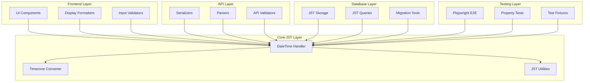

# JST Date/Time Handling Design Document

## Overview

This design establishes a unified JST (Japan Standard Time) date/time handling system across the entire application stack. The solution builds upon the existing Day.js foundation while extending it to provide comprehensive JST support for frontend, API, database, and testing layers. The design ensures temporal consistency, eliminates timezone-related bugs, and provides a robust foundation for Playwright E2E testing.

## Architecture

The JST date/time handling system follows a layered architecture with centralized utilities:



## Components and Interfaces

### DateTime Handler (Core Component)

The centralized DateTime Handler extends the existing Day.js implementation:

```typescript
interface DateTimeHandler {
  // Core JST operations
  now(): JSTDateTime
  parse(input: string | Date | number): JSTDateTime
  format(datetime: JSTDateTime, pattern?: string): string
  
  // Validation
  isValid(input: any): boolean
  validateJSTFormat(input: string): ValidationResult
  
  // Arithmetic
  add(datetime: JSTDateTime, amount: number, unit: TimeUnit): JSTDateTime
  subtract(datetime: JSTDateTime, amount: number, unit: TimeUnit): JSTDateTime
  diff(start: JSTDateTime, end: JSTDateTime, unit?: TimeUnit): number
  
  // Comparison
  isBefore(a: JSTDateTime, b: JSTDateTime): boolean
  isAfter(a: JSTDateTime, b: JSTDateTime): boolean
  isSame(a: JSTDateTime, b: JSTDateTime, unit?: TimeUnit): boolean
}
```

### Timezone Converter

Handles conversion between JST and other timezones:

```typescript
interface TimezoneConverter {
  toJST(input: string | Date, sourceTimezone?: string): JSTDateTime
  fromJST(jstDateTime: JSTDateTime, targetTimezone: string): string
  detectTimezone(input: string): string | null
  validateTimezone(timezone: string): boolean
}
```

### JST Storage Interface

Database layer interface for JST-aware operations:

```typescript
interface JSTStorage {
  store(datetime: JSTDateTime): Promise<void>
  retrieve(id: string): Promise<JSTDateTime>
  query(range: JSTDateRange): Promise<JSTDateTime[]>
  migrate(legacyData: any[]): Promise<MigrationResult>
}
```

## Data Models

### JSTDateTime Type

Core data type representing JST timestamps:

```typescript
type JSTDateTime = {
  readonly value: Dayjs  // Internal Day.js instance with JST timezone
  readonly timezone: 'Asia/Tokyo'
  readonly iso: string   // ISO string with +09:00 offset
  readonly display: string // Human-readable JST format
}
```

### ValidationResult Type

Result type for validation operations:

```typescript
type ValidationResult = {
  isValid: boolean
  errors: string[]
  normalized?: JSTDateTime
}
```

### JSTDateRange Type

Type for date range operations:

```typescript
type JSTDateRange = {
  start: JSTDateTime
  end: JSTDateTime
  inclusive: boolean
}
```

## Correctness Properties

*A property is a characteristic or behavior that should hold true across all valid executions of a system-essentially, a formal statement about what the system should do. Properties serve as the bridge between human-readable specifications and machine-verifiable correctness guarantees.*

Based on the prework analysis, the following correctness properties ensure JST handling reliability:

### Property 1: JST Primary Timezone Consistency
*For any* date/time data processed by any system component, the system should consistently use JST as the primary timezone for all operations.
**Validates: Requirements 1.1**

### Property 2: Database JST Storage Format
*For any* temporal data stored in the database, the data should be stored in JST format with explicit timezone information that can be retrieved unambiguously.
**Validates: Requirements 1.2, 4.1, 4.2**

### Property 3: Frontend JST Display Standards
*For any* temporal data displayed in the frontend, all components should render timestamps in JST format with consistent visual indicators and formatting patterns.
**Validates: Requirements 1.3, 5.1, 5.5**

### Property 4: API JST Input Processing
*For any* API request containing date/time parameters, the system should validate and convert all inputs to JST format before processing.
**Validates: Requirements 1.4, 6.3**

### Property 5: DateTime Handler Format Consistency
*For any* date formatting operation across different system components, the DateTime Handler should provide consistent formatting patterns.
**Validates: Requirements 2.2**

### Property 6: JST Parsing and Normalization
*For any* date/time input string, the DateTime Handler should validate and normalize the data to JST format regardless of input format.
**Validates: Requirements 2.3**

### Property 7: JST Arithmetic Operations
*For any* date arithmetic operation, the DateTime Handler should handle JST-specific calculations including timezone transitions correctly.
**Validates: Requirements 2.4**

### Property 8: Round-trip Format Conversion
*For any* supported date/time representation, converting to another format and back should preserve the original temporal meaning within acceptable precision.
**Validates: Requirements 2.5, 7.5, 8.3**

### Property 9: Database JST Query Handling
*For any* temporal query with JST-based date ranges and comparisons, the database should handle operations correctly and return accurate results.
**Validates: Requirements 4.3**

### Property 10: Database JST Migration Preservation
*For any* legacy timestamp data, migration should convert timestamps to standardized JST format while preserving temporal meaning.
**Validates: Requirements 4.4**

### Property 11: Database JST Backup Integrity
*For any* temporal data backup and restore operation, JST timezone information should be preserved throughout the process.
**Validates: Requirements 4.5**

### Property 12: Frontend JST Input Validation
*For any* date/time input through frontend components, the system should provide JST-aware validation with appropriate error handling.
**Validates: Requirements 5.2**

### Property 13: Frontend JST Relative Time Calculation
*For any* relative time display, the frontend should calculate and display relative timestamps based on JST reference points.
**Validates: Requirements 5.3**

### Property 14: Frontend User Timezone Preference Handling
*For any* user timezone preference setting, the frontend should convert display times from JST to user preferences while maintaining JST as the internal standard.
**Validates: Requirements 5.4**

### Property 15: API JST Response Serialization
*For any* API response containing timestamps, the system should output all timestamps in standardized JST format with explicit timezone indicators.
**Validates: Requirements 6.1**

### Property 16: API JST Input Validation and Error Handling
*For any* malformed temporal data input, the API should reject the input and provide clear JST-based error messages.
**Validates: Requirements 6.2**

### Property 17: API JST Query Interpretation
*For any* temporal query filter or range, the API should interpret all date/time parameters in JST context.
**Validates: Requirements 6.4**

### Property 18: External Data JST Conversion Accuracy
*For any* external date/time data input, the Timezone Converter should accurately convert all inputs to JST format.
**Validates: Requirements 7.1**

### Property 19: JST to External Format Conversion
*For any* JST timestamp requiring external format conversion, the Timezone Converter should accurately convert to required external formats.
**Validates: Requirements 7.2**

### Property 20: Multi-timezone Conversion Accuracy
*For any* input from multiple timezones, the Timezone Converter should maintain conversion accuracy and handle edge cases correctly.
**Validates: Requirements 7.3**

### Property 21: Historical JST Rule Handling
*For any* historical date processing, the Timezone Converter should account for historical timezone rule changes affecting JST.
**Validates: Requirements 7.4**

### Property 22: Parse-Format Inverse Operations
*For any* valid JST datetime string, parsing then formatting should return an equivalent representation, and formatting then parsing should preserve the original datetime value.
**Validates: Requirements 8.2**

### Property 23: Edge Case Boundary Handling
*For any* boundary condition like leap years, month transitions, and timezone changes, JST operations should handle these cases correctly without data corruption.
**Validates: Requirements 8.4**

### Property 24: Availability UI Consistency
*For any* availability slot data returned by the backend, all frontend components displaying that availability information should show identical availability status for the same date/time.
**Validates: Requirements 9.1, 9.2, 9.3, 9.4**

### Property 25: Backend-Frontend Availability Contract
*For any* availability calculation, frontend components should never perform independent availability logic but should derive all display information solely from backend API responses.
**Validates: Requirements 9.1, 9.5**

## Error Handling

### Validation Errors
- Invalid date/time formats return structured error messages with JST format examples
- Timezone conversion failures include source timezone and suggested alternatives
- Database constraint violations provide clear JST-specific guidance

### Fallback Strategies
- Malformed input defaults to current JST time with warning logs
- Missing timezone information assumes JST context
- API errors include JST timestamp for debugging correlation

### Error Logging
- All temporal errors include JST timestamp and operation context
- Structured logging enables timezone-related issue tracking
- Error aggregation identifies patterns in temporal data problems

## Testing Strategy

### Dual Testing Approach

The testing strategy employs both unit testing and property-based testing to ensure comprehensive coverage:

**Unit Testing:**
- Specific examples demonstrating correct JST behavior
- Edge cases like leap years and timezone transitions
- Integration points between system layers
- Error conditions and boundary values

**Property-Based Testing:**
- Universal properties verified across all valid inputs
- Random JST datetime generation for comprehensive coverage
- Minimum 100 iterations per property test for statistical confidence
- Each property test tagged with format: `**Feature: jst-datetime-handling, Property {number}: {property_text}**`

### Property-Based Testing Library

The system uses **fast-check** for JavaScript/TypeScript property-based testing and **Hypothesis** for Python components, providing:
- Sophisticated datetime generators with JST constraints
- Shrinking capabilities for minimal failing examples
- Configurable test iteration counts (minimum 100)
- Integration with existing test frameworks

### E2E Testing with Playwright

Playwright E2E tests validate JST behavior across the complete system:
- User timezone simulation and JST display verification
- Cross-browser JST formatting consistency
- API integration with JST data flow validation
- Database round-trip JST preservation testing

### Test Data Management

- JST-aware test fixtures with known temporal values
- Mock timezone scenarios for conversion testing
- Historical data samples for migration validation
- Performance benchmarks for JST operations under load

### Testing Requirements

Each correctness property must be implemented by a single property-based test with explicit tagging. Unit tests complement property tests by covering specific examples and integration scenarios. The testing framework must run a minimum of 100 iterations for each property test to ensure statistical reliability.